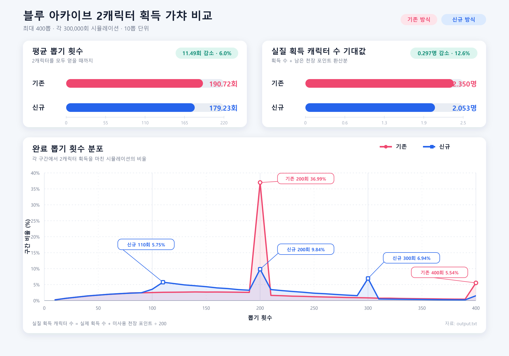
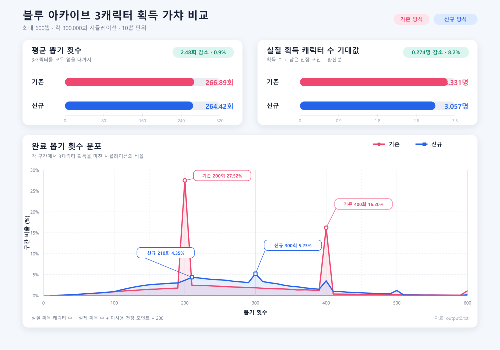

# BAGatchaCompare

`BAGatchaCompare` is a small Bun + TypeScript simulator for comparing two Blue Archive-style gacha systems:

- `oldGatcha`: the existing ceiling-point system.
- `newGatcha`: an alternative system where pickup acquisition can reset the internal ceiling point.

The main question is whether the new system is actually better when leftover ceiling-point value is included, not just the raw number of pulls needed to reach the target pickup characters.





## English

### Purpose

This project compares `oldGatcha` and `newGatcha` through Monte Carlo simulation. It measures both pull-count behavior and effective pickup value, where leftover ceiling points are converted into fractional pickup value:

```ts
effectivePickedChars = pickedChars + roofPoint / 200
```

This makes it possible to compare not only "how many pulls were needed", but also "how much value remained after the run".

### Code Structure

- `src/BAGatcha.ts`: defines `oldGatcha` and `newGatcha`.
- `src/Simulator.ts`: runs reusable simulations, calculates summary statistics, and creates JSON reports for plotting.
- `src/index.ts`: compares both systems and prints a JSON report.
- `docs/compare_main.png`: visualization of the comparison.

### Compared Metrics

The JSON report is designed for LLM analysis and `matplotlib.pyplot` plotting. It includes:

- distribution graph data: `bins`, `counts`, `percentages`, `normalExpectedCounts`, `normalExpectedPercentages`
- `average`
- `standardDeviation`
- `averageEffectivePickedChars`
- `standardDeviationEffectivePickedChars`

### Run

```bash
bun install
bun src/index.ts
```

To save the report:

```bash
bun src/index.ts > output.json
```

### Plotting Example

```python
import json
import matplotlib.pyplot as plt

with open("output.json", encoding="utf-8") as f:
    report = json.load(f)

for series in report["series"]:
    distribution = series["distribution"]
    plt.plot(
        distribution["bins"],
        distribution["percentages"],
        label=series["label"],
    )

plt.xlabel("Gacha count")
plt.ylabel("Percentage (%)")
plt.legend()
plt.show()
```

---

## 한국어

### 목적

이 프로젝트는 몬테카를로 시뮬레이션으로 `oldGatcha`와 `newGatcha`를 비교합니다. 단순히 목표 픽업을 얻기까지 필요한 뽑기 수만 보는 것이 아니라, 남은 천장 포인트의 가치까지 포함해 비교합니다.

천장 포인트 가치는 다음처럼 계산합니다.

```ts
effectivePickedChars = pickedChars + roofPoint / 200
```

즉, `pickedChars`는 실제로 얻은 픽업 수이고 `roofPoint / 200`은 남은 천장 포인트를 픽업 캐릭터 가치로 환산한 값입니다.

### 코드 구조

- `src/BAGatcha.ts`: `oldGatcha`, `newGatcha` 로직을 정의합니다.
- `src/Simulator.ts`: 공용 시뮬레이션, 통계 계산, pyplot용 JSON 리포트 생성을 담당합니다.
- `src/index.ts`: 두 가챠 시스템을 실행하고 비교 JSON을 출력합니다.
- `docs/compare_main.png`: 비교 결과 시각화 자료입니다.

### 비교 지표

출력 JSON은 LLM 분석과 `matplotlib.pyplot` 시각화에 쓰기 좋은 형태입니다. 포함되는 주요 값은 다음과 같습니다.

- 분포 그래프 데이터: `bins`, `counts`, `percentages`, `normalExpectedCounts`, `normalExpectedPercentages`
- `average`
- `standardDeviation`
- `averageEffectivePickedChars`
- `standardDeviationEffectivePickedChars`

### 실행

```bash
bun install
bun src/index.ts
```

리포트를 파일로 저장하려면:

```bash
bun src/index.ts > output.json
```

### pyplot 예시

```python
import json
import matplotlib.pyplot as plt

with open("output.json", encoding="utf-8") as f:
    report = json.load(f)

for series in report["series"]:
    distribution = series["distribution"]
    plt.plot(
        distribution["bins"],
        distribution["percentages"],
        label=series["label"],
    )

plt.xlabel("Gacha count")
plt.ylabel("Percentage (%)")
plt.legend()
plt.show()
```

---

## 日本語

### 目的

このプロジェクトは、モンテカルロシミュレーションで `oldGatcha` と `newGatcha` を比較します。目標ピックアップを獲得するまでのガチャ回数だけでなく、残った天井ポイントの価値も含めて評価します。

天井ポイントの価値は次のように計算します。

```ts
effectivePickedChars = pickedChars + roofPoint / 200
```

つまり、`pickedChars` は実際に獲得したピックアップ数で、`roofPoint / 200` は残った天井ポイントをピックアップキャラクター価値に換算したものです。

### コード構成

- `src/BAGatcha.ts`: `oldGatcha` と `newGatcha` のロジックを定義します。
- `src/Simulator.ts`: 汎用シミュレーション、統計計算、pyplot 向け JSON レポート生成を行います。
- `src/index.ts`: 2つのガチャシステムを実行し、比較用 JSON を出力します。
- `docs/compare_main.png`: 比較結果の可視化画像です。

### 比較指標

出力 JSON は LLM による分析や `matplotlib.pyplot` での可視化に使いやすい形式です。主な項目は次の通りです。

- 分布グラフ用データ: `bins`, `counts`, `percentages`, `normalExpectedCounts`, `normalExpectedPercentages`
- `average`
- `standardDeviation`
- `averageEffectivePickedChars`
- `standardDeviationEffectivePickedChars`

### 実行

```bash
bun install
bun src/index.ts
```

レポートをファイルに保存する場合:

```bash
bun src/index.ts > output.json
```

### pyplot の例

```python
import json
import matplotlib.pyplot as plt

with open("output.json", encoding="utf-8") as f:
    report = json.load(f)

for series in report["series"]:
    distribution = series["distribution"]
    plt.plot(
        distribution["bins"],
        distribution["percentages"],
        label=series["label"],
    )

plt.xlabel("Gacha count")
plt.ylabel("Percentage (%)")
plt.legend()
plt.show()
```
